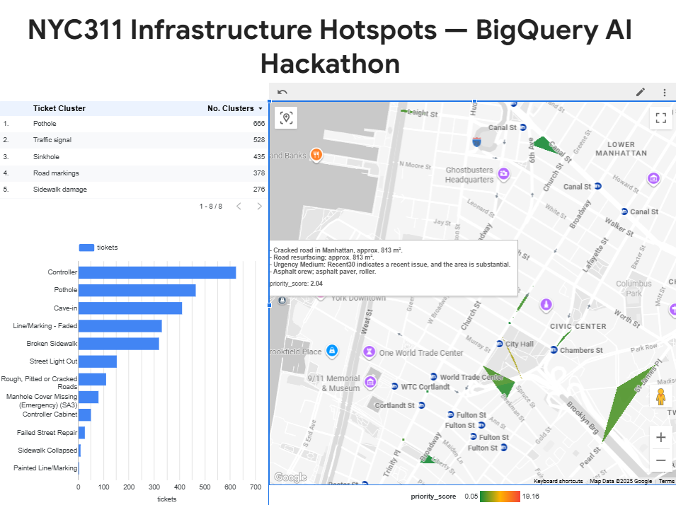
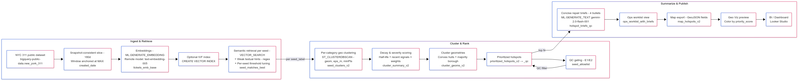

# NYC311 Infra Hotspots: End-to-End Vector Search + Geo Clustering in BigQuery AI

From millions of NYC 311 tickets to *ranked, map-ready repair polygons* with concise crew briefs — in pure BigQuery SQL using generative AI, vector search, and geospatial clustering.

---

## Executive Summary

City field crews don’t fix *tickets*; they fix *places*. A pothole call on Monday and a “broken asphalt” report on Thursday, 40 meters apart, are really the same work area. Our project turns raw NYC 311 complaints into **ranked infrastructure hotspots** with **operational briefs**, end-to-end **inside BigQuery AI**:

- **Semantic retrieval**: Compact category seeds → `ML.GENERATE_EMBEDDING` → `VECTOR_SEARCH` to pull semantically similar tickets per category.  
- **Per-category clustering**: `ST_CLUSTERDBSCAN` in meters clusters tickets into coherent hotspots without mixing types.  
- **Snapshot-consistent prioritization**: Decay by recency + volume + category severity to produce a **priority score**.  
- **Concise repair briefs**: `ML.GENERATE_TEXT` (Gemini) returns four bullet points per hotspot (issue, likely fix, urgency, crew/equipment).  
- **Ops deliverables**: Polygons, centers, and briefs ready for BigQuery Geo Viz / BI dashboards.

**Why this matters**: Dispatch leads need a *ranked worklist of areas*, not a long list of individual calls. By aggregating noisy reports into action-able polygons and summarizing them for crews, we reduce duplicate trips, prioritize urgent work, and make outcomes auditable.

**How to demo (3-step micro-checklist)**  
1) Run Sections **1 → 22** (core pipeline).  
2) Open **Section 28** results in BigQuery **Geo Viz** and color by `priority_score`.  
3) Open the **ops_worklist_with_briefs** view and read the top five briefs.

---

## Problem Statement

NYC publishes millions of 311 service requests. While searchable, they are not **operationally ready**:

- Tickets are **redundant** (multiple residents report the same issue).  
- Text is **heterogeneous** (“pothole”, “asphalt hole”, “sunken patch”, “bumpy road” all mean similar things).  
- Spatial density matters: crews should fix whole **stretches** rather than chase single points.  
- Supervisors need **clear, short briefs**: problem, likely fix, urgency, and crew/equipment hints.

**Goal**: Starting from raw 311 text + lat/long, produce an auditable, region-compliant pipeline that outputs *ranked polygons with briefs* that crews can act on — all within BigQuery.

---

## Impact

- **Faster dispatch**: turn thousands of tickets into a **ranked top-N list** of hotspots by category.  
- **Fewer drive-bys**: cluster nearby reports -> **fewer trips** and better crew utilization.  
- **Better work quality**: time-decay + recent activity flags keep attention on *current* issues.  
- **Explainability & governance**: thresholds, allow-lists, and evaluation tables provide **QA signals** for precision and cohesion.

---

## Users & Personas

- **Street Operations Supervisors**: need polygons + ranked priority + short briefs.  
- **GIS/Analytics**: want reproducible SQL and QA tables to audit the output.  
- **City leadership**: wants dashboards with trend lines, throughput, and equitable geographic coverage.

---

## Architecture (BigQuery-native) see mermaid visual: [Architecture Diagram](https://www.mermaidchart.com/play#pako:eNp1VE1u4zYUvsqDF7NJlYntBCjSYgCLVjMuEidjezIp6kKgpGeJtURqSMqOp-i2B-imB-pNepI-inJqZVBv5Efy-773_9sgVRkOrgdBEKxlquRG5NdrCVDyg2rsNWC5Xcv2clOqfVpwbeF2QS9Mk-Sa1wVMfl4PZjJHY-ENLNBqgTtcD35xLP43GdKT-U8MxsMh1E1SihQybrlB-32i3yUi_9ygPgT-KnBX5xL38UHpbUyYPtmIyJaS16ZQNiCPjTAWpQVDWIQAht9eZI72k5CZ2gOXaaE0ZsAt3E2eINXILWYxqbzyckzEUZVglgmZG2K6uz2_iebRYrKK4ugujKbT2fzGUS-wUhahotSV12Dx2QZ4BAYXF1fujRXpFq2J6SJOKNRXWpzE7msrlOQlzB5_APIWnx2QLSIShMeIre4XMJtPo6c-9tIlACsuSQK0TziR1KjBIAUadNh4GU0W7L3jPINPyLetpw09LYS0LkCNudc8gwfUQYu2hUZKbUn_GknxuGt3EVfcpgWaOKFKdw6hzE47ISTHWNlQObRrBS63PcdD1wZOJ6XU50ofIEcFqQd0SstVzG4_LlfRYhou2WROTtKj6hvA2sT0qYR8sObFpw5s4t2oL-WaZIopP8AbXtXfUWJ2pGEPYFJ11HrPy01Qig3CGWUibXtI5FQPA3__BXsUeeGlOpXYNFXF9eErsfFJ3M7btiQtkim5w2compJIz6Div6rWi0Rp1eTFKbkDfh2Hq_WDFg4lvlB1qOdNrbxb9X_n8fGcCOCfP_6E-HPaJ7oiog8Mcm4pespqNHwbjV7yyEsa7lL8X2GZ67g2eBKj0j64QTVFT4G56lK8qTBI6ay50JBQHjau0S4hoRSg9_t0rFbR04pyRmUVwej8ItiU3BQ0QkP3sAsq9jSvQ2KjdoQM7GlNON9hJ3DvcIp65XgY74UtOoY-3FXtjteAz7WipRbADaofl_dz2Agss9bTitenme3jXWkIAo_iC9Qaj-JMlYoiP0BXnkPsWq4__sxVI5zBW5hSuIniut1Yt0ptqYWWtsmE6lWiXaIQBO9o_XXmyJvjzhx3Jj_a3B9cejv06LBDhx4ddujQo8Pj40tvXnmTeSzrsMxjWYdlHss6LPNY1mEnznxZTXHJEyw9-fBEC6yqYe6Bx_Mrd04duxGlm6tT_1hrSddwH2kJ2pIGY067uE3Z4Pd_AVGUJYo)

**Pipeline in one sentence**: seeds → embeddings → vector search → per-seed clustering → snapshot-consistent scoring → polygons → briefs → ops view.

**Key building blocks**  
- **Embedding & vector search**: `ML.GENERATE_EMBEDDING` for both tickets and category seeds; `VECTOR_SEARCH` (cosine) for semantic retrieval.  
- **Optional ANN**: `CREATE VECTOR INDEX` (IVF) is created and auto-used only if coverage is healthy (coverage gating).  
- **Weak-label guardrails**: regex-based “hints” estimate a **lower-bound precision** per seed; used for automatic threshold tuning.  
- **Clustering**: `ST_CLUSTERDBSCAN(geom, eps_m, minPts)` partitioned **by seed_label** to avoid cross-type mixing.  
- **Prioritization**: snapshot-consistent time decay anchored to **MAX(created_date)** in the working slice; recent14/recent30 signals; per-category weights.  
- **Geometries**: convex hulls per cluster; zero-area hulls are buffered to guarantee polygons.  
- **Briefs**: `ML.GENERATE_TEXT` (low temperature) returns exactly four bullets (<80 words), with borough and category context.

We keep everything **US region-pinned** with `SET @@location = 'US'` at the top of *every* SQL cell.

---

## Data & Privacy

- **Source**: NYC 311 public dataset (lat/long provided by source).  
- **PII minimization**: Only a **coarse text** signal is embedded (complaint type + descriptor + borough + city). **No street addresses** are sent to the model.  
- **Regional compliance**: All compute and remote model calls run in the **US multi-region**.  
- **Snapshot window**: 180 days (configurable); window anchored to the source table’s **MAX(created_date)** so decay metrics are consistent across reruns.

---
## Outputs

---
## What We Built (Step-by-Step)

### 1) Dataset & Config
- Creates `infra_prioritizer_us` dataset in US region.  
- Centralized `config` table sets **DBSCAN eps/minPts**, **decay half-life**, **top_k** retrieval cap, **precision floor**, **ANN coverage minimum**, and **max output clusters**.

### 2) Working Slice
- Materializes `tickets_base` for the last 180 days; computes a **PII-safe `ticket_text`** string and a `GEOGRAPHY` point `geom`.  
- QA sanity: row counts + min/max dates.

### 3) Embeddings & Seeds
- Registers a **remote embedding model** and embeds both **tickets** and **seed terms** (e.g., Pothole, Sidewalk damage, Sinkhole…).  
- We produce a **shared vector space** where seeds and ticket texts are comparable via cosine distance.

### 4) Semantic Retrieval with Guardrails
- `VECTOR_SEARCH` pulls **top-K** nearest tickets **per seed**.  
- We gate **ANN** usage behind an **index coverage** threshold; if the IVF index coverage is below a configured minimum, we fall back to **exact** search to protect quality.  
- A **weak-label table** (regex hints) estimates **lower-bound precision** to avoid over-claiming success.  
- An **auto-tuner** sweeps distance cutoffs per seed to pick the **largest threshold** that satisfies both the precision floor and a minimum yield. Problematic seeds can be hand-overridden.

### 5) Best-Seed Dedupe
- Some tickets match multiple seeds; we keep the **closest** match that **agrees with the weak label** when available, minimizing cross-category leakage.

### 6) Per-Category Clustering
- `ST_CLUSTERDBSCAN` (meters + minPts) **partitioned by `seed_label`** to avoid mixing e.g., potholes with sidewalk damage.  
- We provide **E2 diagnostics** (cohesion, noise, n_clusters) under different settings (eps/minPts) to show stability.

### 7) Snapshot-Consistent Prioritization
- For each cluster, we compute counts, recent14/recent30 signals, and **decayed ticket mass** using a half-life (default 30 days).  
- **Priority score**: `(decayed_tickets + 0.5·recent_30 + 1.0·recent_14) × category_weight`.  
- **Weights** reflect operational severity (e.g., Sinkholes > Signals > Potholes).

### 8) Polygons & Borough
- Build **convex hulls** per cluster; if the hull area is zero (colinear points), we **buffer** the geometry to guarantee a polygon.  
- Compute a **majority borough** vote for labeling and briefs.  
- Export both **center** and **hull** (with `ST_ASGEOJSON`) for mapping.

### 9) Brief Generation (Gemini)
- A deterministic prompt drives `ML.GENERATE_TEXT` to return **exactly 4 bullets (<80 words)**: #1 summary with borough, #2 likely fix & rough units if inferable, #3 urgency (Low/Medium/High) with reason, #4 crew type + equipment.  
- Temps are low (0.1–0.2) for **determinism**.  
- If remote model access is not available, we create a fallback table with a placeholder brief so the notebook remains runnable.

### 10) QC Gating & Ops View
- We compute **E1 retrieval precision** vs. weak labels for each seed at the chosen thresholds.  
- Only seeds passing **precision floor** and **minimum selection** are **allow-listed**.  
- We regenerate the ranked hotspots and briefs over the **QC-filtered set** and publish a **single ops view** for dispatch:
  `infra_prioritizer_us.ops_worklist_with_briefs` (ranked, polygons, scores, briefs).

---

## Results & Evaluation

### E0 — Distributional Checks
- Matches by seed label and seed×borough help spot anomalies (e.g., extremely skewed distributions).

### E1 — Retrieval Precision (Lower Bound)
- We compute **precision@200** for each seed on **raw retrieval** (not thresholded) vs. weak labels.  
- Seeds like **Pothole**, **Sidewalk damage**, **Manhole cover**, **Traffic signal**, **Street light out**, **Road markings**, **Sinkhole** show very high precision in our window.  
- Categories like **Uneven pavement** and (sometimes) **Guardrail damage** are **conservatively excluded** unless their precision improves at stricter cutoffs.  
- We publish **per-seed threshold curves** (distance cutoff → precision & yield) to justify tuned thresholds.

### E2 — Clustering Cohesion & Stability
- For several `(eps, minPts)` settings around our chosen config, we report:  
  - number of clusters,  
  - noise points, and  
  - **mean intra-cluster distance** (meters).  
- The selected parameter set yields **compact clusters** with reasonable noise, and the metrics change smoothly across nearby settings — a **stability indicator**.

### Ops Readiness
- **QC-filtered** ranked hotspots have **non-zero polygons**, reasonable areas, and informative briefs.  
- A lightweight **Geo Viz** view displays the top-N hotspots colored by `priority_score`; clicking reveals `seed_label`, `borough`, `recent_14/30`, and sample descriptors, with the brief next to it in the ops table.

---

## Governance, Cost, and Reliability

- **Regional pinning**: Every SQL cell begins with `SET @@location='US';`.  
- **Privacy**: No house numbers or intersection strings are sent to the model. Only **category descriptors + borough + city** are embedded.  
- **Cost guards**:  
  - 180-day slice (easy to switch to 60 for reviewers).  
  - `top_k` cap on vector search.  
  - ANN index used **only** when coverage is healthy; otherwise exact search.  
  - Deterministic, low-token brief generation.  
- **Reproducibility**: Fully qualified identifiers; snapshot anchoring to the slice’s `MAX(created_date)`; consistent decay math across runs; hand overrides for any problematic seeds.  
- **Auditability**:  
  - Threshold tables, allow-list, and E1/E2 outputs.  
  - A single, human-readable **ops view** with all fields needed for dispatch.

---

## Demo Instructions (Reviewers & Judges)

**Shortest path to “aha”:**  
1. Run sections **1 → 22**.  
2. Open the query in **Section 28** in **Geo Viz**. Color by `priority_score`.  
3. Explore the top areas; note how polygons concentrate dense complaint patterns.  
4. Open `infra_prioritizer_us.ops_worklist_with_briefs` (QC-filtered). Read the **top 5 briefs**.  
5. (Optional) Open the “Evaluation” sections (23–25) to see **precision**, **threshold curves**, **cohesion**, and **gating** outputs.  
6. Share the map/table in a **Looker Studio** dashboard for exec viewing.

**Reviewer-friendly runtime switches**  
- To lower cost/time, change the slice in Section 6 from **180 → 60 days** and set `topk_vec=300` in the config.  
- Leave Section 9 as-is to reuse cached embeddings if present.

---

## Technical Deep Dive (Why these choices?)

- **Seed-driven retrieval** gives human-interpretable control. Small, auditable seed phrases (e.g., “pothole, broken asphalt…”) make the system **traceable** and **tunable**.  
- **Per-category clustering** avoids mixing distinct issues (e.g., signal timing vs. sidewalk slabs) and yields **clean polygons** aligned to work scopes.  
- **Snapshot-consistent decay** prevents surprising score flips caused by freshness drift when different reviewers run at different times.  
- **Weak labels as a floor**: Regex hints aren’t perfect, but they provide a **defensible lower bound** on precision; we only ship categories that clear the bar.  
- **Geometric normalization**: Convex hulls can degenerate to lines with colinear points; adding a small buffer guarantees valid polygons for mapping and routing.  
- **Deterministic briefs**: Dispatchers want crisp, consistent summaries—hence low temperature and a rigid prompt that returns exactly four bullets with operational details.

---

## Limitations & Risks

- **Weak-label noise**: Regexes miss edge cases; we mitigate by tuning thresholds conservatively and offering hand overrides.  
- **Sparse categories**: Low-volume seeds (or rare neighborhoods) may under-cluster; `eps`/`minPts` are configurable.  
- **Geometric artifacts**: Hulls can include non-drivable gaps; remedies include alpha-shapes, buffers by right-of-way, or snapping to centerlines.  
- **Model/embedding drift**: We monitor **embedding dimensionality** and keep index coverage checks; thresholds can be re-tuned if models change.

---

## Roadmap

1. **Active seed expansion** from centroid tickets (semi-supervised).  
2. **Budget-aware routing**: incorporate unit-cost priors and travel time to pick **next-best work area**.  
3. **Human-in-the-loop editor** for cluster merges/splits and polygon tweaks.  
4. **Equity analytics**: borough/CB weighting and service level tracking by neighborhood demographics.  
5. **Multimodal**: fuse imagery (object tables) for severity estimation (e.g., panel spall vs. heave).

---

## Repro & Assets

**Primary tables & view**
- `infra_prioritizer_us.prioritized_hotspots_v2`  
- `infra_prioritizer_us.prioritized_hotspots_v2_qc`  
- `infra_prioritizer_us.map_hotspots_v2`  
- **View**: `infra_prioritizer_us.ops_worklist_with_briefs`  

**Briefs**
- `infra_prioritizer_us.hotspot_briefs`  
- `infra_prioritizer_us.hotspot_briefs_qc`  

**Models**
- `infra_prioritizer_us.text_embedding_005`  
- `infra_prioritizer_us.gemini_text`

**Index (optional)**
- `infra_prioritizer_us.tickets_ix` on `tickets_emb_base(embedding)`

**Runbook**  
- Set project/location/dataset in Section 2; keep **US** region.  
- Ensure BigQuery remote connection to Vertex AI exists; if not, the notebook continues with embedding/brief fallbacks.  
- Follow Sections **1 → 22** for the core pipeline; **23 → 25** for evaluation; **26 → 28** for publishing and map preview.

---

## Team, License & Acknowledgements

- **License**: CC BY 4.0 (as requested by the hackathon).  
- **Thanks**: NYC Open Data; Google BigQuery AI & GIS teams for first-class SQL+AI primitives; and the Kaggle community.

---

## Appendix — Selected SQL Notes

- Every SQL section starts with `SET @@location = 'US';` to guarantee regional compliance.  
- Vector retrieval uses `VECTOR_SEARCH` with **cosine** distance; ANN is only enabled when IVF coverage is healthy.  
- Clustering uses `ST_CLUSTERDBSCAN(geom, eps_m, minPts) OVER (PARTITION BY seed_label)`.  
- Prioritization anchors decay to the slice’s `MAX(created_date)` to ensure snapshot-consistent scores.  
- Geometry export uses `ST_ASGEOJSON(hull)` and `ST_ASGEOJSON(center)` for BI tools and Geo Viz.  
- Briefs use `ML.GENERATE_TEXT` with a deterministic, bullet-only prompt.

---

## Reviewer Quick Start (again)

1. Run Sections **1 → 22**.  
2. Open **Section 28** outputs in **Geo Viz** (color by `priority_score`).  
3. Read top briefs in `ops_worklist_with_briefs`.  
4. Skim Sections **23–25** to see metrics that justify the QC allow-list.
